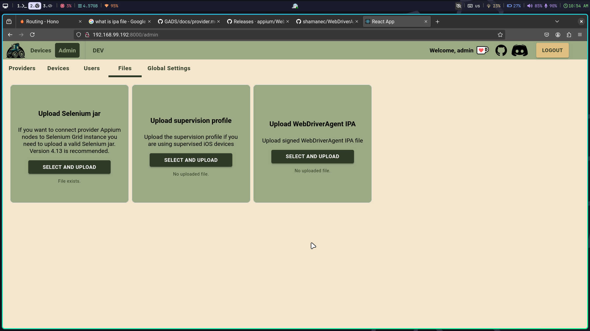
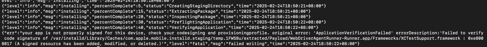

Table of Content

1. [Problem](#problem)
2. [Resources](#resources)
3. [Checking](#checking)

## Problem

The problem is that to be able to execute test cases on iOS device, the target device must have WebDriverAgent.
Due to the current architecture, we need IPA (iOS App Store Package) of WebDriverAgent, which can be install on any iOS devices.

We need to upload it in our app. Thus only IPA works. 

Currently, we only able to sign for one device which is targeted during the build process.

## Resources

WebDriverAgent can be found in [https://github.com/appium/WebDriverAgent/releases](https://github.com/appium/WebDriverAgent/releases) which is the official version or
[https://github.com/shamanec/WebDriverAgent](https://github.com/shamanec/WebDriverAgent) which is a fork version from the official one. 

**It would be great if we can sign the latter (the fork) one.**

The documentation on preparing the WebDriverAgent can be found in [https://github.com/shamanec/GADS/blob/main/docs/provider.md#webdriveragent-ipa](https://github.com/shamanec/GADS/blob/main/docs/provider.md#webdriveragent-ipa)

In the [GADS documentation about WebDriverAgent](https://github.com/shamanec/GADS/blob/main/docs/provider.md#prebuilt-custom-webdriveragent), it also mention that there is prebuilt one, which can use some tools to sign with the developer account.

## Checking

After successfully built the IPA file, we are used to check the output is correct or not with `go-ios`.

1. Install `go-ios` via `npm` or, build from source if there is any error. [https://github.com/danielpaulus/go-ios](https://github.com/danielpaulus/go-ios). The executable name is `ios`.
2. Connect the device via USB and need to trust the computer. If the device is trusted, we can check the `ios info --udid=<udid of the ios device>`, else can't.
3. We can install with `ios install --path=<path to the ipa file> --udid=<udid of the ios device>`.

This is the output, which is failed to install.

